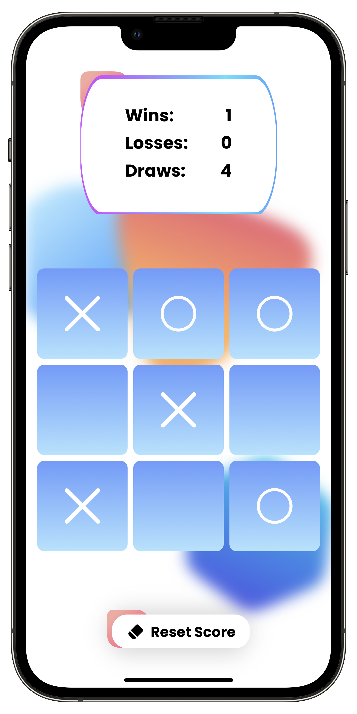

# Tic Tac Toe

This beautiful Tic-Tac-Toe application is developed using Swift, SwiftUI and MVVM. It offers a classic game on a 3x3 grid versus AI. 



## Features

- Simple and intuitive user interface.
- Animated background.
- PvE.
- Game board that automatically updates after each move.
- Hard AI.
- Score board and reset button.

## Planned

- Choose AI difficulty.
- Choose colors of your playground.
- PvP.

## Requirements

- iOS 16.4 or later.

## Installation

1. Clone the Tic Tac Toe repository:

   ```shell
   git clone https://github.com/your_username/tic-tac-toe.
   ```
2. Open the `Tic-Tac-Toe.xcodeproj` project in Xcode.
3. Build and run the project on a simulator or a real device.
